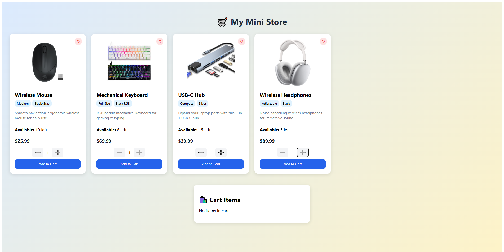
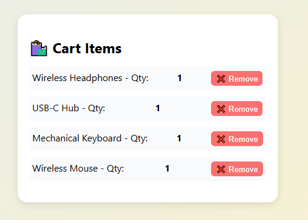

# 🛒 My Mini Store (React.js)

A simple and responsive **React.js mini e-commerce store** where users can:
- View products with details (image, size, color, description)
- Select product quantity (with stock limits)
- Add/remove products from cart
- Live stock updates when adding to cart

---

## ✨ Features
- **Multiple Product Display** with size, color, and description
- **Quantity Selection** with `+` and `-` buttons
- **Stock Management** – prevents adding more than available
- **Cart Section** with remove option
- **Responsive Design** for mobile & desktop
- **Interactive UI** with nice styling

---

## 🛠️ Technologies Used
- **React.js** - UI library
- **useState Hook** - for state management
- **CSS** - for styling
- **JavaScript (ES6+)** - logic handling

---

## 📂 Project Structure

```
src/
├── App.js # Main component
├── App.css # Styling
├── index.js # Entry point
└── ...

```


---

## ⚙️ How to Run Locally

### 1️⃣ Clone the Repository
git clone https://github.com/yourusername/my-mini-store.git
cd my-mini-store


### 2️⃣ Install Dependencies
npm install


### 3️⃣ Start Development Server
npm start

The app will open at `http://localhost:5173`

---

## 📷 Screenshots


   
   

---

## 🔮 Future Improvements
- Add product search & filter
- Integrate with backend & database
- Add wishlist feature (heart icon functionality)
- Checkout page with price calculation

---


## 📜 License
This project is licensed under the [MIT License](https://github.com/gohilgautam/MIT-Licence/blob/main/LICENSE)
