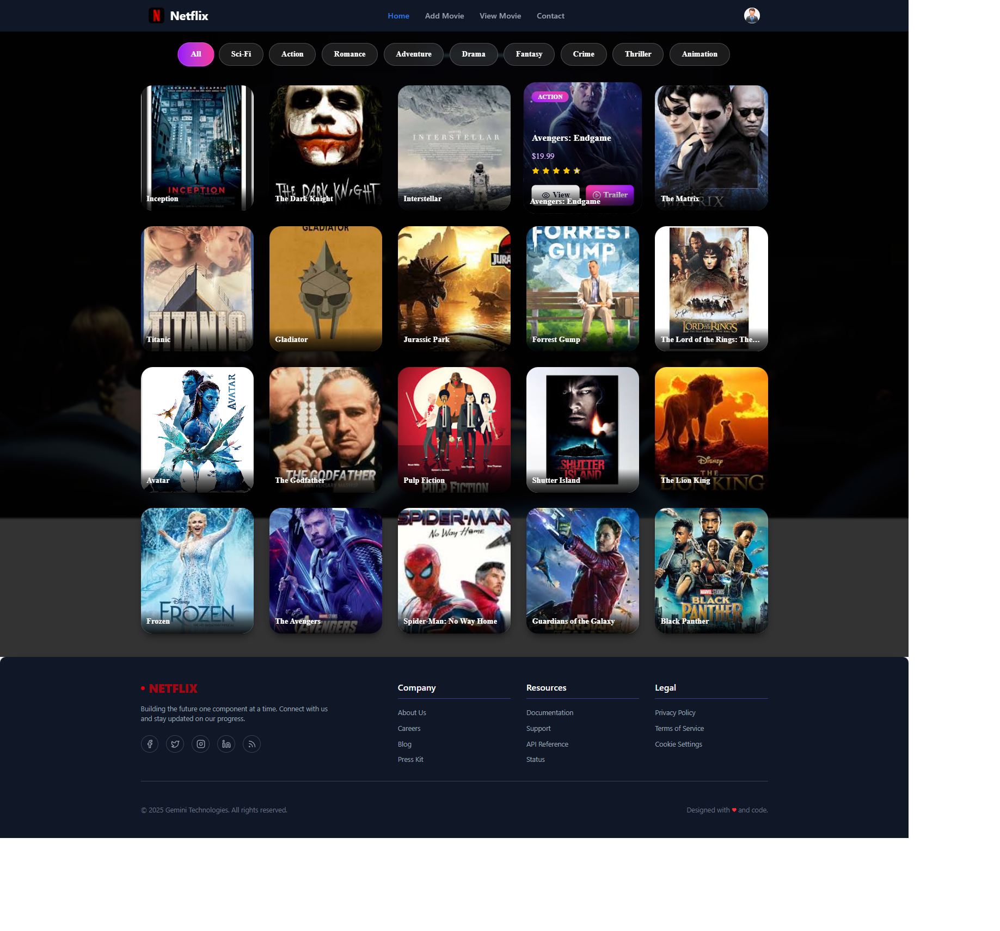
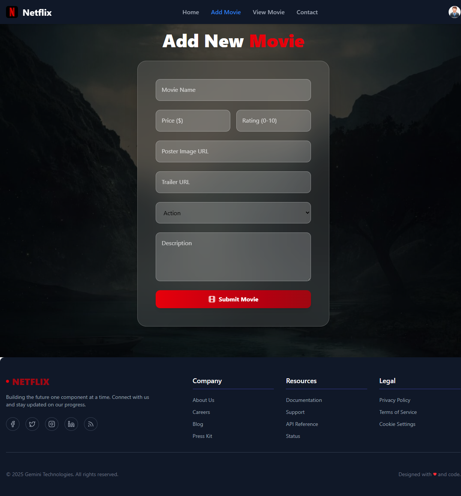
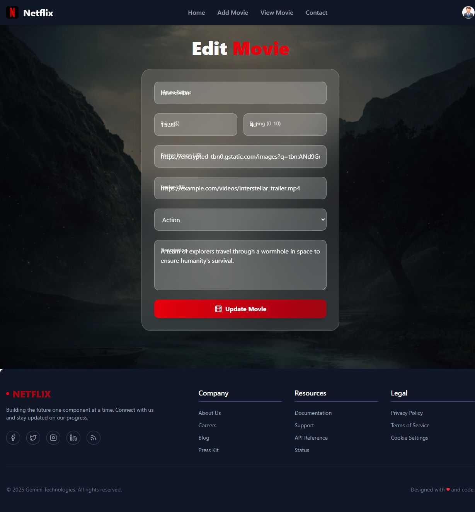
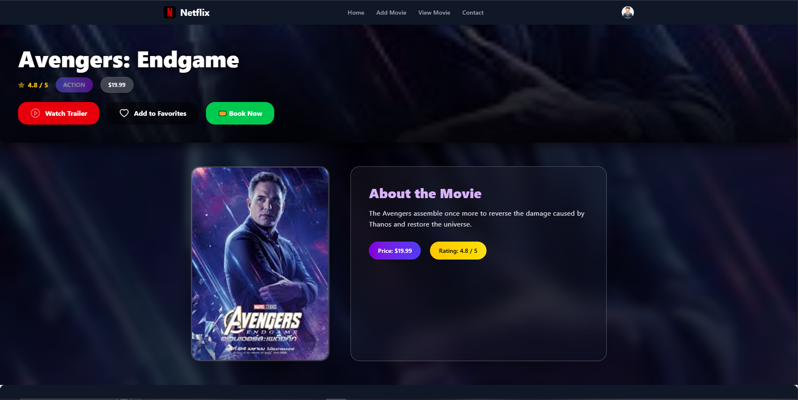
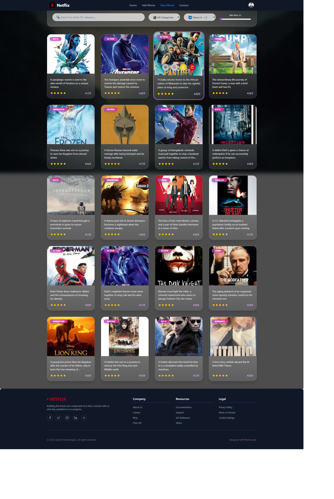
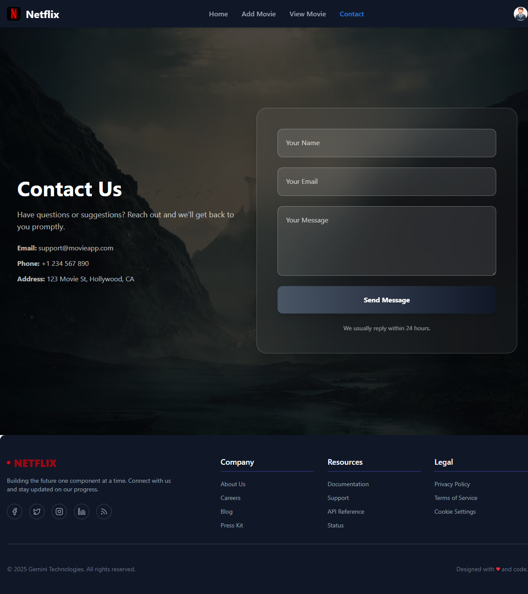
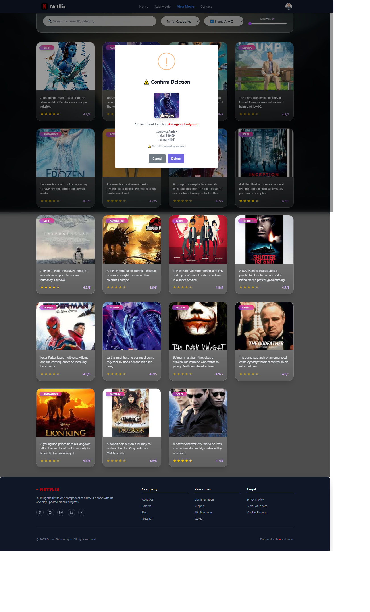

# Movie Details React App

[](https://reactjs.org/)
[](https://www.typescriptlang.org/)
[](https://vitejs.dev/)
[](https://tailwindcss.com/)

A modern movie management application built with React, TypeScript, and Vite. Allows users to view, add, edit, and delete movies with a beautiful UI.

## Features

- **View Movies**: Browse all movies on the home page with detailed cards.
- **Movie Details**: View comprehensive information about a specific movie.
- **Add Movies**: Form to add new movies with fields like name, price, category, rating, trailer, and description.
- **Edit Movies**: Pre-filled forms for editing existing movies.
- **Delete Movies**: Remove movies with confirmation dialogs.
- **Responsive Design**: Built with TailwindCSS for mobile and desktop.
- **Animations**: Smooth transitions using Framer Motion.
- **Notifications**: Toast notifications for user feedback.
- **Alerts**: SweetAlert2 for confirmations and alerts.

## Tech Stack

- **Frontend**: React 19, TypeScript, Vite
- **Styling**: TailwindCSS
- **Routing**: React Router v7
- **Icons**: Lucide React, React Icons
- **Animations**: Framer Motion
- **Notifications**: React Toastify
- **Alerts**: SweetAlert2
- **Backend**: JSON Server (for development)

## Prerequisites

- Node.js (version 16 or higher)
- npm or yarn

## Installation

1. Clone the repository:
   ```bash
   git clone <repository-url>
   cd movie-details
   ```

2. Install dependencies:
   ```bash
   npm install
   ```

## Running the Application

1. Start the backend server (JSON Server):
   ```bash
   npx json-server --watch src/JSON/db.json --port 3000
   ```

2. In a new terminal, start the development server:
   ```bash
   npm run dev
   ```

3. Open your browser and navigate to `http://localhost:5173` (or the port shown in the terminal).

## API Details

The application uses JSON Server for mock API operations. Base URL: `http://localhost:3000/movies/`

### Endpoints

- **GET /movies/**: Fetch all movies
- **POST /movies/**: Add a new movie
- **GET /movies/:id**: Fetch a single movie by ID
- **PATCH /movies/:id**: Update a movie by ID
- **DELETE /movies/:id**: Delete a movie by ID

### Movie Data Structure

```typescript
interface Movie {
  id: string;
  name: string;
  price: number;
  image: string;
  category: string;
  rating: number;
  trailer: string;
  description: string;
}
```

## Routes

- `/` - Home page displaying all movies
- `/movie/:id` - Detailed view of a specific movie
- `/add-movie` - Form to add a new movie
- `/edit-movie/:id` - Form to edit an existing movie
- `/view-movie` - List view of all movies with delete options
- `/contact` - Contact information page

## Folder Structure

```
movie-details/
├── public/
│   ├── vite.svg
│   └── images/
│       ├── Add-Movie.png
│       ├── Capture.png
│       ├── Contact-Page.png
│       ├── Detail-Page.png
│       ├── Edit-Movie.png
│       ├── Home-Page.png
│       └── View-Page.png
├── src/
│   ├── assets/
│   │   └── react.svg
│   ├── Components/
│   │   ├── Footer/
│   │   │   └── Footer.tsx
│   │   └── Header/
│   │       └── Header.tsx
│   ├── JSON/
│   │   └── db.json
│   ├── Pages/
│   │   ├── Contact_Page/
│   │   │   └── ContactPage.tsx
│   │   ├── Edit-Movie/
│   │   │   └── EditMovie.tsx
│   │   ├── Home-Page/
│   │   │   └── HomePage.tsx
│   │   ├── Movie-Details/
│   │   │   └── MovieDetailPage.tsx
│   │   ├── Movie-Form/
│   │   │   └── AddMovie.tsx
│   │   └── View-Movie/
│   │       └── ViewMovie.tsx
│   ├── Routes/
│   │   └── routes.tsx
│   ├── Services/
│   │   └── MovieAPIServices.ts
│   ├── App.tsx
│   ├── index.css
│   └── main.tsx
├── eslint.config.js
├── index.html
├── package.json
├── package-lock.json
├── README.md
├── tsconfig.app.json
├── tsconfig.json
├── tsconfig.node.json
└── vite.config.ts
```

## Screenshots

| Home Page | Add Movie |
|-----------|-----------|
|  |  |

| Edit Movie | Movie Detail Page |
|------------|-------------------|
|  |  |

| View Movies | Contact Page |
|-------------|--------------|
|  |  |

### Delete Confirmation


## Testing

To ensure the application works correctly, test the following critical areas:

- Navigation between all routes
- Adding new movies with form validation
- Editing existing movies
- Deleting movies with confirmation
- API error handling and user feedback
- Responsive design on different screen sizes

Run the linter:
```bash
npm run lint
```

Build for production:
```bash
npm run build
npm run preview
```

## Contributing

Contributions are welcome! Please follow these steps:

1. Fork the repository
2. Create a feature branch: `git checkout -b feature/your-feature-name`
3. Commit your changes: `git commit -m 'Add some feature'`
4. Push to the branch: `git push origin feature/your-feature-name`
5. Open a pull request

## License

This project is licensed under the MIT License - see the [LICENSE](LICENSE) file for details.

---

Built with ❤️ using React and TypeScript.
