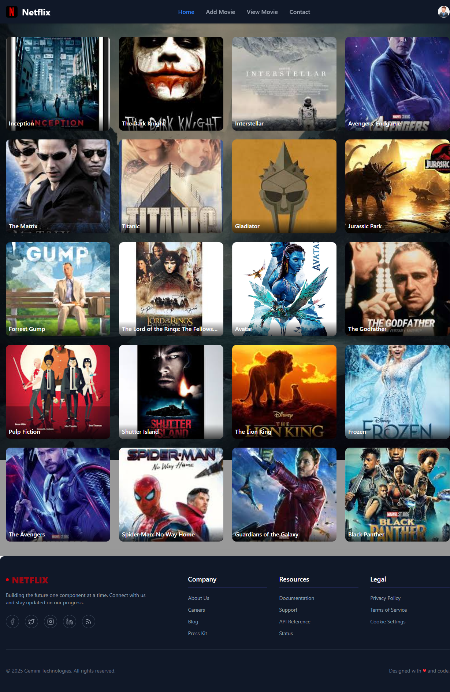
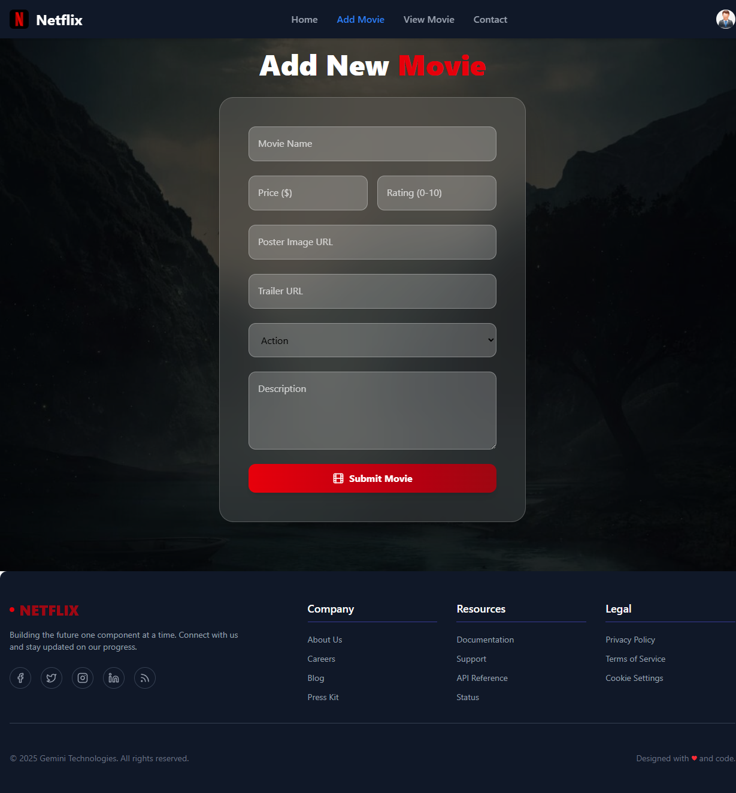
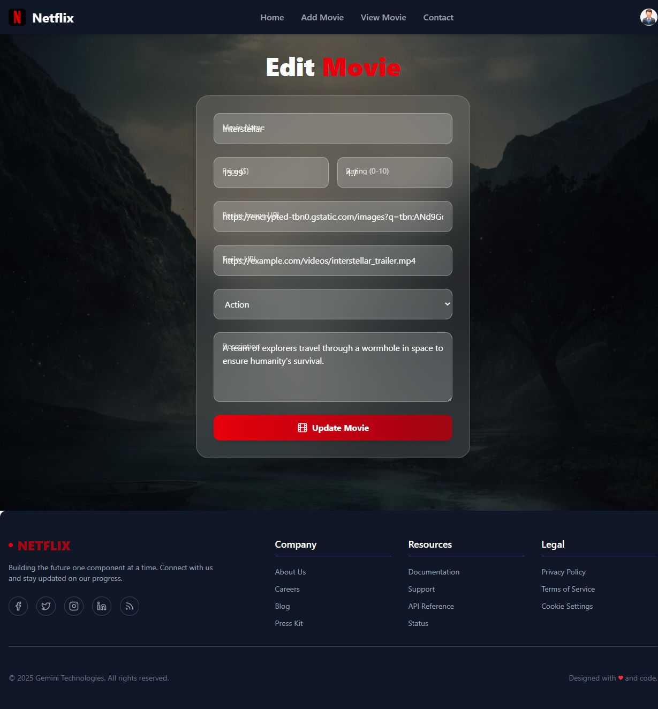
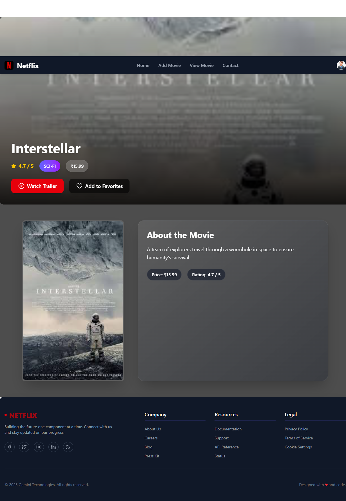
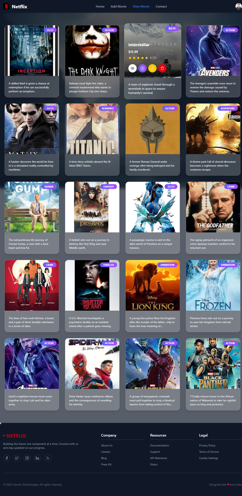
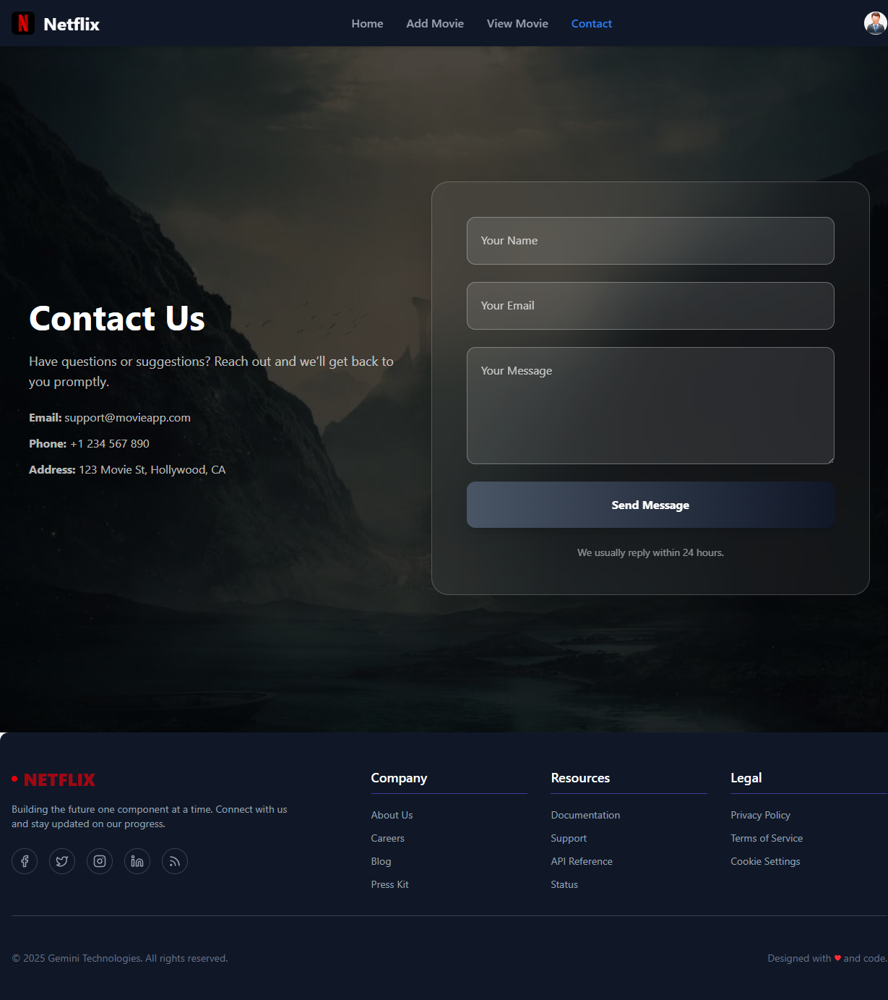
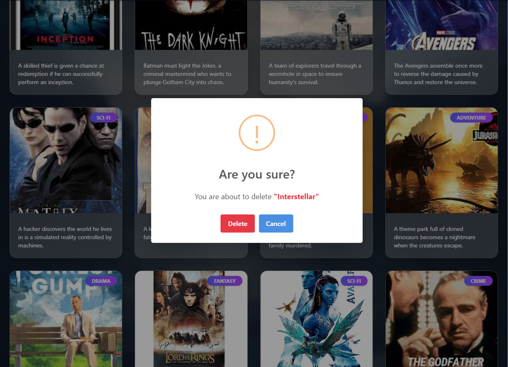

# Movie Details React App

This React + TypeScript + Vite project is a movie management application that allows users to view, add, edit, and delete movies.

## Features

- View all movies on the home page.
- View detailed information about a single movie.
- Add new movies with details such as name, price, category, rating, trailer, and description.
- Edit existing movies with pre-filled form data.
- Delete movies with confirmation prompts.
- Routing handled with React Router v6 using `createBrowserRouter`.
- API service for CRUD operations on movies.

## Routes

- `/` - Home page showing all movies.
- `/movie/:id` - Movie detail page for a specific movie.
- `/add-movie` - Form to add a new movie.
- `/edit-movie/:id` - Form to edit an existing movie.
- `/view-movie` - View all movies in a list with delete functionality.
- `/contact` - Contact page.

## Technologies Used

- React 18
- TypeScript
- Vite
- React Router v6
- SweetAlert2 for alerts and confirmations
- Fetch API for backend communication

## Folder Structure

```
movie-details/
├── public/
│   └── vite.svg
├── src/
│   ├── assets/
│   │   └── react.svg
│   ├── Components/
│   │   ├── Footer/
│   │   │   └── Footer.tsx
│   │   └── Header/
│   │       └── Header.tsx
│   ├── JSON/
│   │   └── db.json
│   ├── Pages/
│   │   ├── Contact_Page/
│   │   │   └── ContectPage.tsx
│   │   ├── Edit-Movie/
│   │   │   └── EditMovie.tsx
│   │   ├── Home-Page/
│   │   │   └── HomePage.tsx
│   │   ├── Movie-Details/
│   │   │   └── MovieDetailPage.tsx
│   │   ├── Movie-Form/
│   │   │   └── AddMovie.tsx
│   │   └── View-Movie/
│   │       └── ViewMovie.tsx
│   ├── Routes/
│   │   └── routes.tsx
│   ├── Services/
│   │   └── MovieAPIServices.ts
│   ├── App.tsx
│   ├── index.css
│   └── main.tsx
├── eslint.config.js
├── index.html
├── package.json
├── package-lock.json
├── README.md
├── tsconfig.app.json
├── tsconfig.json
├── tsconfig.node.json
└── vite.config.ts
```

## Development

### Running the app

```bash
npm install
npm run dev
```

### API Service

The app communicates with a backend API at `http://localhost:3000/movies/` for movie data.

### Editing Movies

The edit movie page pre-fills the form with existing movie data fetched by ID and allows updating the movie details.

## Screenshots

| Home Page | Add Movie |
|-----------|-----------|
|  |  |

| Edit Movie | Movie Detail Page |
|------------|-------------------|
|  |  |

| View Movies | Contact Page |
|-------------|--------------|
|  |  |

### Delete Page


## Testing

Critical areas to test:

- Navigation between routes.
- Adding, editing, and deleting movies.
- Form validation and submission.
- API error handling and user feedback.

You can choose to perform critical-path testing (key elements only) or thorough testing (complete coverage).

## License

MIT License
