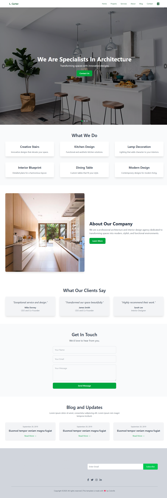

# L. Carter - Architecture & Interior Design Portfolio

A modern, responsive portfolio website for L. Carter, a professional architecture and interior design agency specializing in transforming spaces with innovative and creative designs.

## 🌟 Features

- **Responsive Design**: Fully responsive layout that works seamlessly across all devices
- **Interactive Hero Slider**: Dynamic hero section with automatic transitions and manual navigation
- **Smooth Animations**: Powered by Framer Motion for engaging user interactions
- **Multi-Page Navigation**: Complete website with Home, Projects, Services, About, Blog, and Contact pages
- **Modern UI Components**: Clean, professional design with green color scheme
- **Contact Forms**: Integrated contact forms for client inquiries
- **Blog Section**: Showcase of design insights and company updates
- **Service Showcase**: Highlighting key services like Creative Stairs, Kitchen Design, and Interior Blueprints

## 📸 Screenshots


.png)
.png)
.png)
.png)
.png)

## 🛠️ Technologies Used

- **Frontend Framework**: React 19 with TypeScript
- **Build Tool**: Vite
- **Styling**: Tailwind CSS 4.x
- **Animations**: Framer Motion
- **Routing**: React Router DOM v7
- **Icons**: Lucide React & Font Awesome
- **Linting**: ESLint with TypeScript support

## 🚀 Getting Started

### Prerequisites

- Node.js (v16 or higher)
- npm or yarn

### Installation

1. Clone the repository:
```bash
git clone <repository-url>
cd pagination
```

2. Install dependencies:
```bash
npm install
```

3. Start the development server:
```bash
npm run dev
```

4. Open your browser and navigate to `http://localhost:5173`

## 📁 Project Structure

```
src/
├── Components/
│   ├── Header/
│   │   └── Header.tsx          # Navigation component
│   └── Footer/
│       └── Footer.tsx          # Footer component
├── Pages/
│   ├── Home/
│   │   └── HomePage.tsx        # Landing page with hero, services, testimonials
│   ├── About/
│   │   └── AboutPage.tsx       # About company page
│   ├── Blog/
│   │   └── BlogPage.tsx        # Blog and updates page
│   ├── Contact/
│   │   └── ContactPage.tsx     # Contact information and form
│   ├── Project/
│   │   └── ProjectPage.tsx     # Portfolio projects showcase
│   ├── Services/
│   │   └── ServicesPage.tsx    # Services offered
│   └── Error/
│       └── EroorPage.tsx       # 404 error page
├── Routes/
│   └── MyRoutes.ts             # Application routing configuration
├── assets/
│   ├── images/                 # Hero images, about images, etc.
│   └── react.svg
├── App.tsx                     # Main application component
├── main.tsx                    # Application entry point
└── index.css                   # Global styles
```

## 📜 Available Scripts

- `npm run dev` - Start development server with hot reload

## 🎨 Design Highlights

- **Color Scheme**: Professional green palette (#22c55e, #16a34a) with neutral backgrounds
- **Typography**: Clean, modern fonts with proper hierarchy
- **Interactive Elements**: Hover effects, smooth transitions, and micro-animations
- **Accessibility**: Focus indicators and semantic HTML structure

## 📞 Contact

For inquiries about architecture and interior design services, please visit the Contact page or reach out through the website's contact form.

---

Built with ❤️ using React, TypeScript, and modern web technologies.
