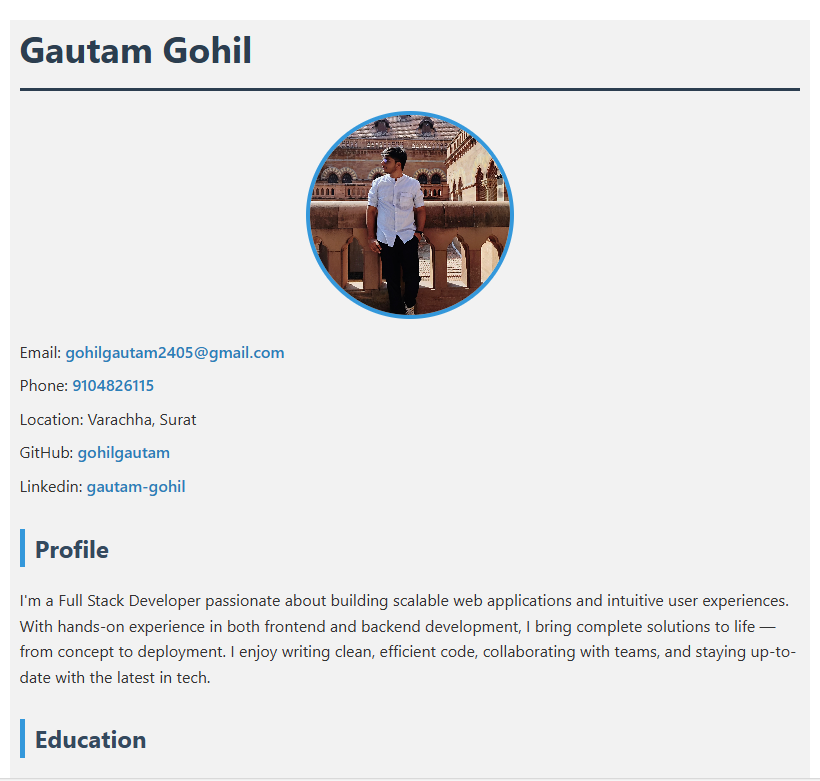
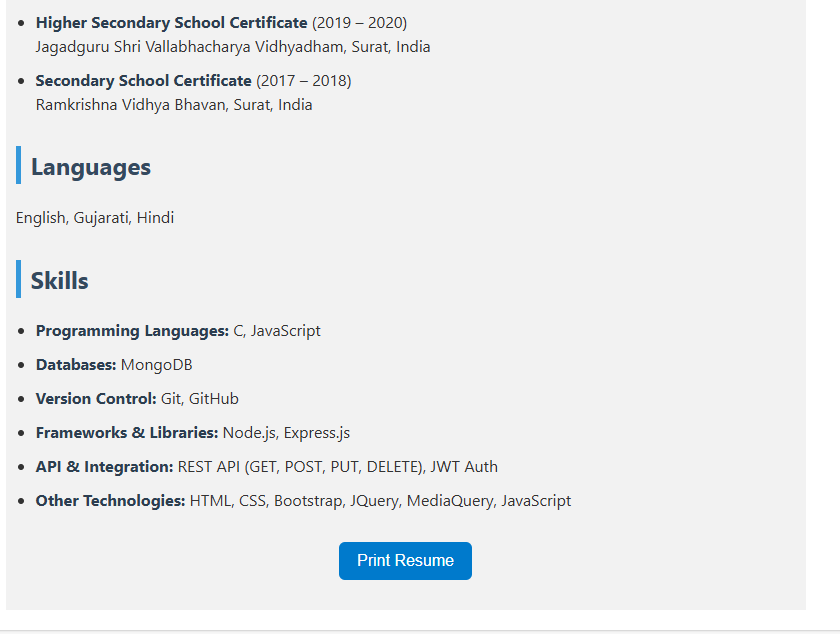
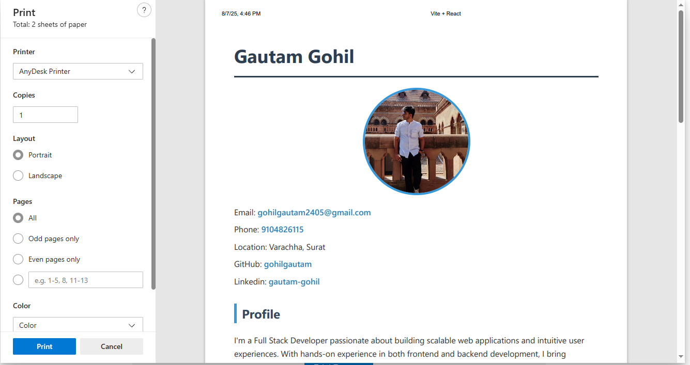

## 🚀 Features

- 🖼️ Profile photo and personal introduction
- 📧 Contact details with clickable email, GitHub, and LinkedIn
- 🎓 Education section
- 🌐 Languages spoken
- 💻 Technical skills listed by category
- 🖨️ One-click print functionality for physical copies or PDFs
- 🎨 Simple and clean responsive design


## 🛠️ Technologies Used

- **React.js**
- **HTML5 & CSS3**
- **JavaScript**
- **Bootstrap (optional)**
- **Media Queries**
```
project-root/
│
├── public/
│ ├── image/
│ │ └── Gautam.jpg # Profile image
│ └── App.css # CSS styles
│
├── src/
│ └── App.jsx # Main resume component
│
├── package.json
└── README.md
```


🖨️ Print Resume
Click on the "Print Resume" button at the bottom of the page to print or save the resume as a PDF directly from the browser.

🔗 Connect with Me
GitHub: gohilgautam

LinkedIn: Gautam Gohil

Email: gohilgautam2405@gmail.com

Phone: 9104826115

🙌 Acknowledgements
This resume site was built to showcase my skills as a Full Stack Developer and provide a printable, professional representation of my experience and background.


  
  
  
