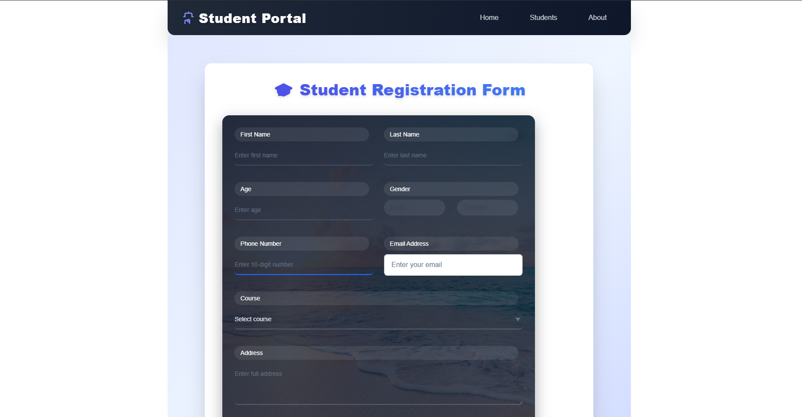
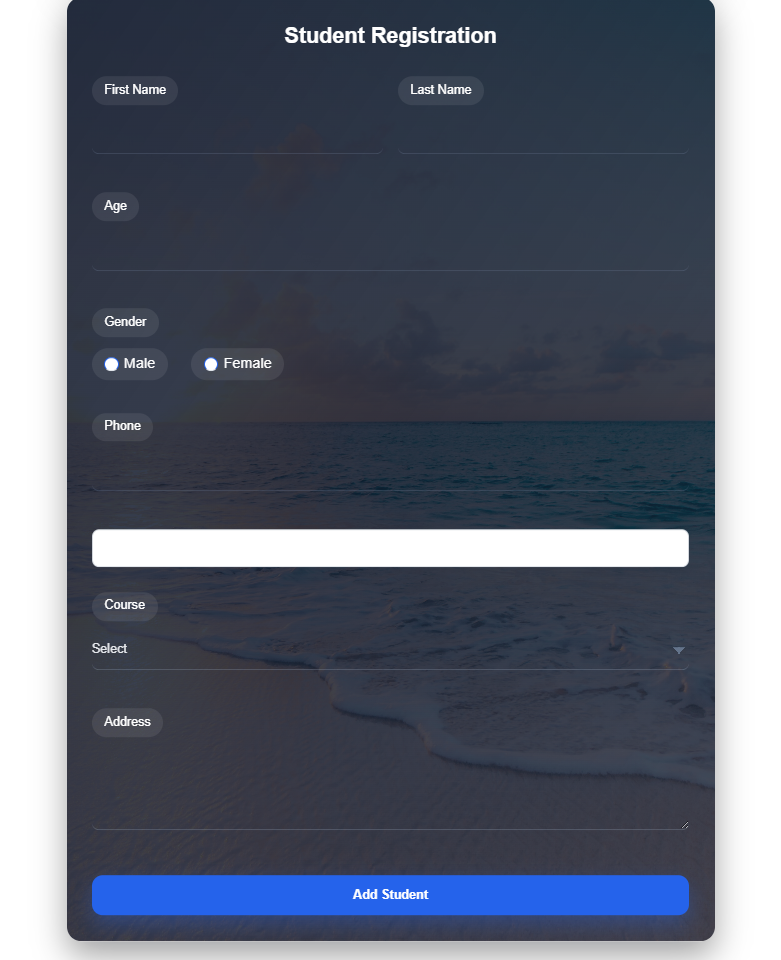
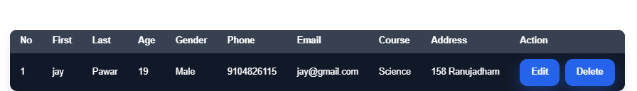
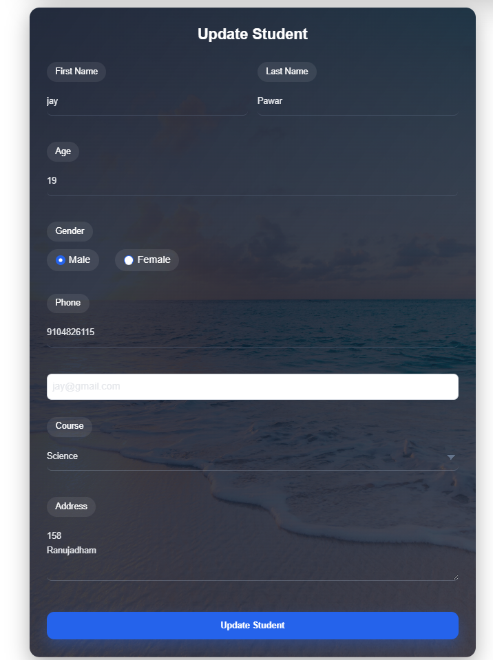
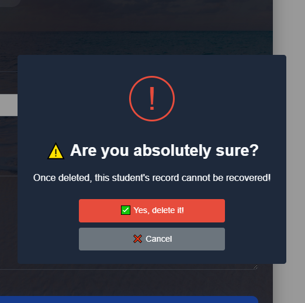

# 🎓 Student Registration Portal

A simple and modern **Student Registration Portal** built with **React + TypeScript** and styled using **Tailwind CSS**.  
The app allows users to **register students** via a form and displays the data in a responsive, styled table.

---

## ✨ Features

- 📋 **Student Registration Form**
  - First Name, Last Name, Age, Gender, Phone, Email, Course, Address  
  - Gender selection with radio buttons  
  - Dropdown list for courses  

- 🎨 **Modern UI**
  - Fully responsive design  
  - Gradient backgrounds  
  - Styled inputs and buttons with hover effects  
  - White label text for better readability  

- 📊 **Student Table**
  - Displays all registered students  
  - Alternating row colors  
  - Hover effects for rows  
  - "No students registered yet..." fallback  

---


## 🖼️ Screenshots

### Navbar



### 📝 Registration Form



### 📊 Registered Students Table


### 📊 Update Students Table


### 🚮 Delete Students


## 🛠️ Tech Stack

- **React** (with Hooks & TypeScript) ⚛️  
- **Tailwind CSS** 🌈  

---

## 🚀 Getting Started

### 1. Clone the repository
```bash
git clone https://github.com/your-username/student-registration-portal.git
cd student-registration-portal

npm install

npm run dev

```

Open your browser at 👉 http://localhost:5173

```

src/
 ├── components/
 │    └── StudentForm.tsx   # Main form + table component
 │    └── Navbar.tsx        # Navigation bar
 ├── App.tsx                # App entry point
 ├── main.tsx               # React DOM render
 └

```