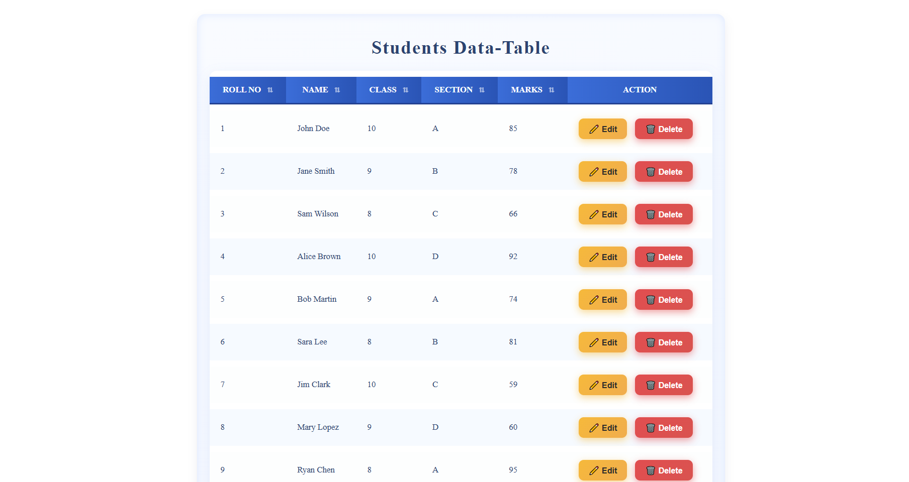
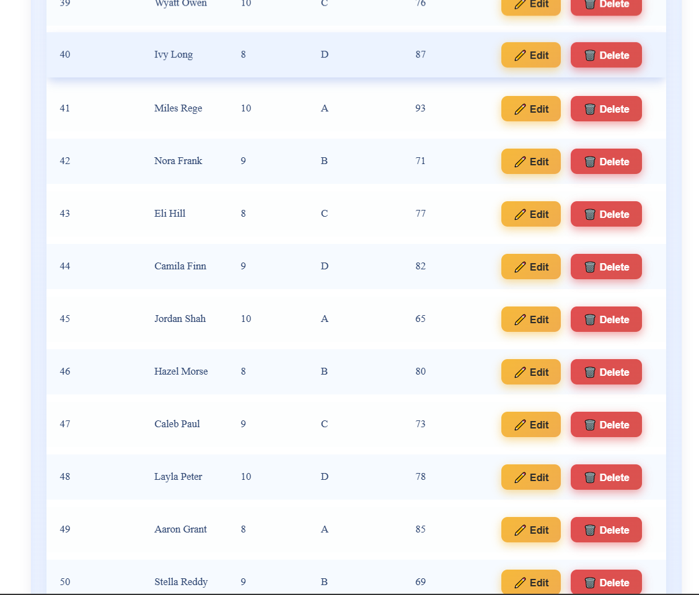

# 📚 Student Management Table (React.js)

A **React.js** project that displays a **stylish, responsive, sortable** table of students with their details such as Roll Number, Name, Class, Section, and Marks.  
Includes **Edit** and **Delete** action buttons for future functionality.

---

## 🚀 Features

- 🎨 **Modern UI** with gradient backgrounds and shadows
- 📱 **Fully Responsive** for mobile screens
- 📊 Displays **50 student records** in a tabular format
- 🔍 Prepared for **sorting functionality** (by default, clickable headers are styled)
- 🖱 **Hover animations** on rows and buttons
- ♿ Includes **accessibility styles** (visually hidden elements for screen readers)
- 🎯 Made using **React Hooks** (`useState`)

---

## 📂 Project Structure

```

project-folder/
│
├── App.jsx # Main React component containing student data and table rendering
├── App.css # Styling for table layout, buttons, and responsiveness
├── package.json
└── README.md

```


---

## 🛠 Installation & Setup

1️⃣ **Clone the repository**  


2️⃣ **Install dependencies**  
npm install

3️⃣ **Start the development server**  
npm start


Now open **`http://localhost:5173`** in your browser. 🎉

---

## 💻 Usage

- **Table Headers (⇅)** — clickable for sorting (future feature)
- **Edit Button** — for editing student records (to be implemented)
- **Delete Button** — for deleting records (to be implemented)
- **Responsive Mode** — In mobile view, each row becomes a card-style block

---

## 🎨 Screenshots





---

## 📜 Technologies Used

- **React.js** (Frontend Framework)
- **CSS3** (Responsive & Animated Styling)
- **JavaScript (ES6+)**  

---

## 📌 Future Improvements

- ✅ Implement column sorting logic
- ✅ Add search & filter functionality
- ✅ Store and manage data using API / database
- ✅ Implement edit & delete functionality with state updates

---

## 🧑‍💻 Author

**Your Name**  
💼 GitHub: [gohilgautam](https://github.com/gohilgautam)  
📧 Email: gohilgautam2406@gmail.com  

---

## 📜 License
This project is licensed under the [MIT License](https://github.com/gohilgautam/MIT-Licence/blob/main/LICENSE)

