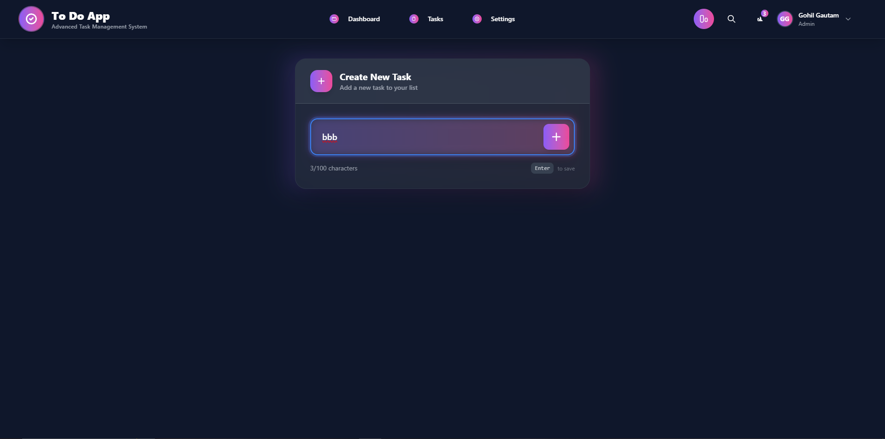
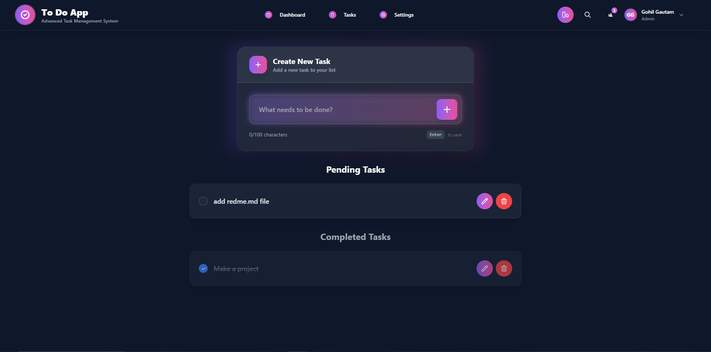
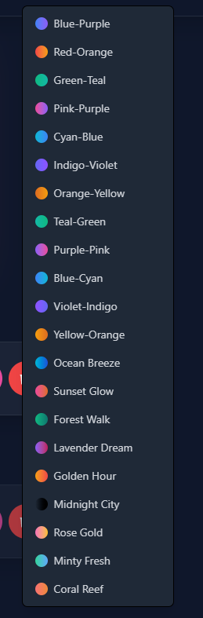
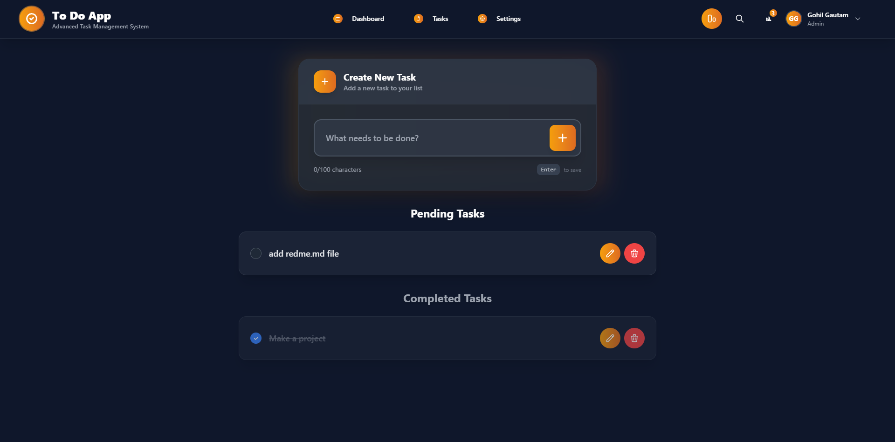

# 📝 To-Do List App

A modern, responsive **Task Management Application** built using **React, Vite, and TailwindCSS**.  
This app allows users to **add, edit, delete, and manage tasks** with support for **lightweight local storage persistence** and **customizable themes**.

---

## 🚀 Features
- ✅ Add, edit, and delete tasks  
- 🎯 Mark tasks as completed or pending  
- 🌈 Theme customization with multiple gradient options  
- 💾 Persistent storage using **LocalStorage**  
- 🎨 Modern UI built with **TailwindCSS**  
- 📱 Fully responsive design  

---

## 🛠️ Tech Stack
- **React** (Frontend UI framework)  
- **Vite** (Fast development build tool)  
- **TailwindCSS** (Styling & responsive UI)  

---

## 📂 Project Structure

```
TO-DO_LIST/
│── public/
│ └── vite.svg
│── src/
│ ├── assets/
│ │ └── react.svg
│ ├── App.tsx
│ ├── index.css
│ ├── main.tsx
│ └── vite-env.d.ts
│── index.html
│── package.json
│── tsconfig.json
│── vite.config.ts
└── README.md

```


---

## ⚡ Getting Started

### 1️⃣ Clone the repository
```bash
git clone https://github.com/your-username/todo-list-app.git
cd todo-list-app


2️⃣ Install dependencies
npm install

3️⃣ Run development server
npm run dev

4️⃣ Build for production
npm run build

----

🎨 Theme Options

The app comes with 20+ gradient themes like:

Blue-Purple

Red-Orange

Forest Walk 🌲

Sunset Glow 🌅

Midnight City 🌃

Rose Gold 🌸

📸 Screenshots

(Add screenshots of your app here)

,
,
,
,
